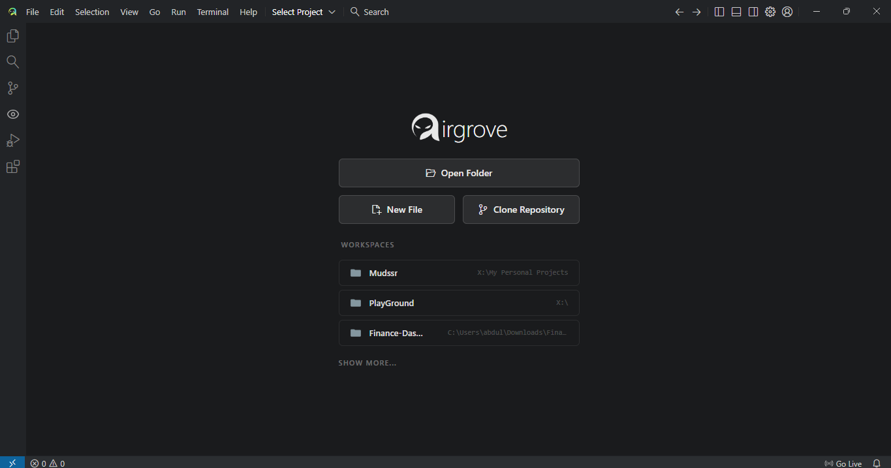

<div align="center">

# 🚀 AirGrove


### Next-Gen Autonomous AI Coding Environment


> **🚧 Beta Notice** — AirGrove is actively under development. Features are being added, refined, and improved with every iteration. Expect rapid progress — and occasional rough edges.

</div>

---

## What is AirGrove?

**AirGrove** is a fully autonomous AI-powered IDE built from the ground up. It doesn't just suggest code — it **thinks, plans, and executes** entire development workflows without you leaving the editor.

Every update brings improved AI reasoning, smarter tooling, and a tighter developer experience. This is a living project — built in public, improved continuously.

---

## 🖥️ See It in Action

### Welcome Screen

<div align="center">

<p><em>Open a folder, clone a repo, or pick up a recent workspace — all from a clean launch screen.</em></p>
</div>

---

### Full IDE — Real-Time AI Development

<div align="center">

<p><em>Code editor + built-in live preview + AI agent panel — all synced in real-time.</em></p>
</div>

---

### Built-in Preview Browser with Element Selection

> 🔍 **No tab switching. No external browser.** AirGrove has a full browser engine built directly into the IDE. Open your project, click any element on the live preview, and the AI immediately highlights it in your code. Tell it what to change — watch it happen instantly.

<div align="center">

<p><em>Click any UI element in the live preview → AI highlights it in code → modify with a single message.</em></p>
</div>

**How it works:**
1. 👁️ Your website renders live **inside the IDE** — no external browser needed
2. 🖱️ Click any element (button, card, nav, text) to select it
3. 🔗 The code for that element is immediately highlighted in the editor
4. 💬 Tell the AI: *"Make this button blue"* or *"Fix the padding on this card"*
5. ⚡ Code updates — preview refreshes instantly

---

### Working Demo

<div align="center">

</div>

<div align="center">

</div>

---

### AI Model Selection

<div align="center">

<p><em>Switch between NVIDIA NIM, Groq, OpenAI, and more — no restart required.</em></p>
</div>

---

## ⚡ Key Features

| Feature | Description |
| :--- | :--- |
| **Autonomous Agent** | Plans with a Task Map before touching your code — full transparency at every step |
| **Built-in Preview Browser** | Full browser engine inside the IDE — test websites without leaving the window |
| **Click-to-Select Elements** | Click UI elements in preview → instantly jump to that code in the editor |
| **Vision Analysis** | Paste a screenshot — AI reads errors, layout bugs, or styling issues visually |
| **13+ Specialized Tools** | File ops, code search, terminal, web research, scraping, image generation — all built-in |
| **RAG + LSP** | Vector-indexed codebase + Language Server Protocol for context-aware, precise edits |
| **Document Intelligence** | Reads PDF, DOCX, PPTX, and web URLs to gather requirements and write code from them |
| **Interactive Terminal** | Real PTY — AI can run installs, tests, build scripts, and deployments autonomously |
| **Streaming Reasoning** | Watch the AI's thoughts in real-time as it solves your problem |
| **Zero Context Switching** | Research → Code → Test → Deploy — all inside one window |

---

## 🛠️ Tools — What Each One Does

AirGrove gives the AI agent **13+ specialized tools** to complete real development tasks. Here's what each one does:

---

### 📂 File Operations

| Tool | What It Does |
| :--- | :--- |
| `read_file` | Opens any file and reads its contents — supports line numbers, offset/limit for large files, and auto-parses PDF, DOCX, and PPTX documents |
| `write_file` | Creates a new file or appends content to an existing one in the workspace |
| `edit_file` | Makes precise code changes using character-perfect search/replace blocks — no full rewrites, just surgical edits |
| `delete_file` | Safely removes files by moving them to trash (not permanent delete) |
| `list_directory` | Shows the full directory tree with Git status tags — modified, untracked, and staged files highlighted |
| `glob_tool` | Finds files by pattern across the entire project (e.g. `**/*.ts`, `src/**/components/*.jsx`) |

---

### 🔍 Code Intelligence

| Tool | What It Does |
| :--- | :--- |
| `grep_tool` | Searches file contents with full Regex support — finds function definitions, variable usages, import chains. Returns matching lines with context |
| `lsp_query` | Connects to the Language Server Protocol for professional code intelligence: go-to-definition, find all references, hover type info, and workspace-wide symbol search |

---

### 🌐 Built-in Preview Browser

| Feature | What It Does |
| :--- | :--- |
| **Live Preview Tab** | Renders your website or web app **inside the IDE** — no external browser, no tab switching |
| **Element Selection** | Click any element in the rendered page — the AI identifies it and jumps to the matching code in the editor |
| **AI Integration** | After selecting an element, just tell the AI what to change — it modifies the code and the preview refreshes |
| **Real-time Sync** | Every code edit immediately reflects in the preview — full hot-reload feel |

---

### 🎨 Visual & Creative

| Tool | What It Does |
| :--- | :--- |
| `imageGen_tool` | Generates AI images using the NVIDIA FLUX.1 API — describe what you need, it creates a professional-grade asset and saves it directly into your `assets/` folder |
| `lens_analyze` | Analyzes images using NVIDIA Gemma-3 Vision — upload a screenshot of an error, broken UI, or design mockup and the AI describes exactly what's wrong and how to fix it |

---

### 🌐 Web Research & Scraping

| Tool | What It Does |
| :--- | :--- |
| `web_search` | Runs deep web searches using Tavily API — fetches up-to-date docs, Stack Overflow solutions, GitHub issues, and best practices relevant to your problem |
| `web_scraper` | Extracts clean, structured Markdown or JSON from any website using Firecrawl — perfect for reading API documentation, whitepapers, or technical guides without browser rendering issues |

---

### 💻 Terminal Execution

| Tool | What It Does |
| :--- | :--- |
| `terminal_run` | Runs shell commands in a real interactive PTY session — the AI can install packages, run build scripts, execute tests, start servers, and manage deployments. Fully bidirectional — the AI reads output and reacts to it. Supports PowerShell on Windows |

---

### 🧠 Context & Memory

| Feature | What It Does |
| :--- | :--- |
| **RAG Manager** | Indexes your entire codebase using vector embeddings — the AI can recall relevant code from anywhere in the project, not just open files |
| **Document Parser** | Reads PDF, Word (.docx), PowerPoint (.pptx), and plain text files — used to parse requirements, specs, or design briefs |
| **Git Awareness** | Monitors Git status to focus on recently changed files — AI understands what's new and what's untouched |
| **LSP Integration** | Hooks into Language Server Protocol for real-time type info, definitions, and references — the AI knows the shape of your code |

---

## 🚀 Getting Started

### Prerequisites
- **Node.js** v18+
- **npm** v9+
- API keys (see Environment Setup below)

### Installation

```bash
git clone https://github.com/yourusername/AirGrove.git
cd AirGrove
npm install
npm start
```

For development with hot reload:
```bash
npm run dev
```

---

## 🔐 Environment Setup

Create a `.env` file in the project root:

```env
NVIDIA_API_KEY=your_nvidia_api_key_here
GROQ_API_KEY=your_groq_api_key_here
OPENAI_API_KEY=your_openai_api_key_here
TAVILY_API_KEY=your_tavily_api_key_here
FIRECRAWL_API_KEY=your_firecrawl_api_key_here
```

**Get your keys:**
- NVIDIA NIM → https://build.nvidia.com/
- Groq → https://console.groq.com/
- OpenAI → https://platform.openai.com/api-keys
- Tavily → https://tavily.com/
- Firecrawl → https://www.firecrawl.dev/

---

## 🤝 Contributing

To add a new tool to AirGrove:

1. Create `src/main/ai/tools/definitions/MyNewTool.js`
2. Extend `BaseTool` and implement `toJSON()` and `execute()`
3. Export the class — `ToolManager` auto-discovers and registers it at startup

```javascript
const BaseTool = require('../BaseTool');

class MyNewTool extends BaseTool {
    constructor() {
        super();
        this.name = 'my_tool';
        this.description = 'What this tool does';
        this.parameters = {
            type: "object",
            properties: {
                arg1: { type: "string", description: "First argument" }
            },
            required: ["arg1"]
        };
    }

    async execute({ arg1 }) {
        return { text: "Result", data: {} };
    }
}

module.exports = MyNewTool;
```

---

## 🐛 Troubleshooting

| Issue | Fix |
| :--- | :--- |
| AI edits are incorrect | Call `read_file` first to get accurate line numbers; include 5+ lines of context in search blocks |
| Terminal not executing | On Windows use PowerShell syntax — `;` not `&&`, `$env:VAR` not `export VAR` |
| Preview shows blank page | Ensure dev server is running and the port matches `portManager.js`; try a manual refresh |
| Out of memory | Exclude `node_modules` from RAG indexing; limit `list_directory` recursion depth |

---

## 📄 License

MIT — see [LICENSE](LICENSE) for details.

---

<div align="center">

**Built by [Abdulkarim Shaikh](https://github.com/abdulkarim20-ui)**

🚧 *Beta — improving with every commit.*

⚡ *"The future of coding is autonomous."*

</div>
